# <!-- fit --> Flex of Squat

Een praktische uitdaging ...

---

# Flex/Punch Detector

- In een eerste fase gaan we proberen om een flex/punch detector te maken


---

# Arduino Nano 33 BLE Sense

- We gebruiken hiervoor een Arduino Nano 33 BLE Sense bordje
- Krachtige processor, de nRF52840 van Nordic Semiconductors, een 32-bits ARM® Cortex®-M4 CPU die draait op 64 MHz.
- 1 MB aan flash
- 256KB aan RAM geheugen

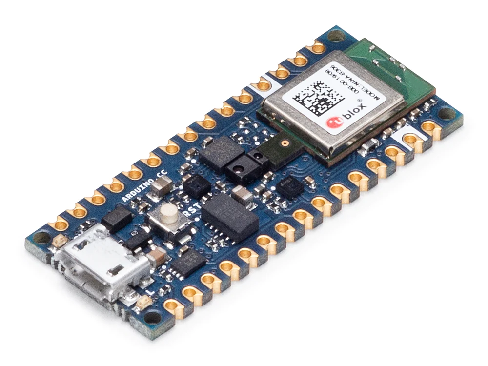

---

# Hoe gaan we een punch meten?

- 9-axis Inertial Sensor
  - Een Inertial Measurement Unit (IMU) wordt gedefinieerd als een 9-assige sensor die oriëntatie, snelheid en zwaartekracht meet door accelerometer, gyroscoop en magnetometer in één te combineren.
    - **Accelerometer:** meten van versnelling van het device
    - **Gyroscoop:** oriëntatie en hoeksnelheid van een object meten
    - **Magnetometer:** een kompas

*Niet te veel zorgen over maken. Het binnen lezen van deze data is a piece-of-cake*

---

# Edge Impulse

- Edge Impulse is het toonaangevende ontwikkelingsplatform voor **machine learning op edge-apparaten**, gratis voor ontwikkelaars en vertrouwd door ondernemingen.
- Edge Devices
  - Denk aan microcontrollers, ESPs, Arduino's, ...

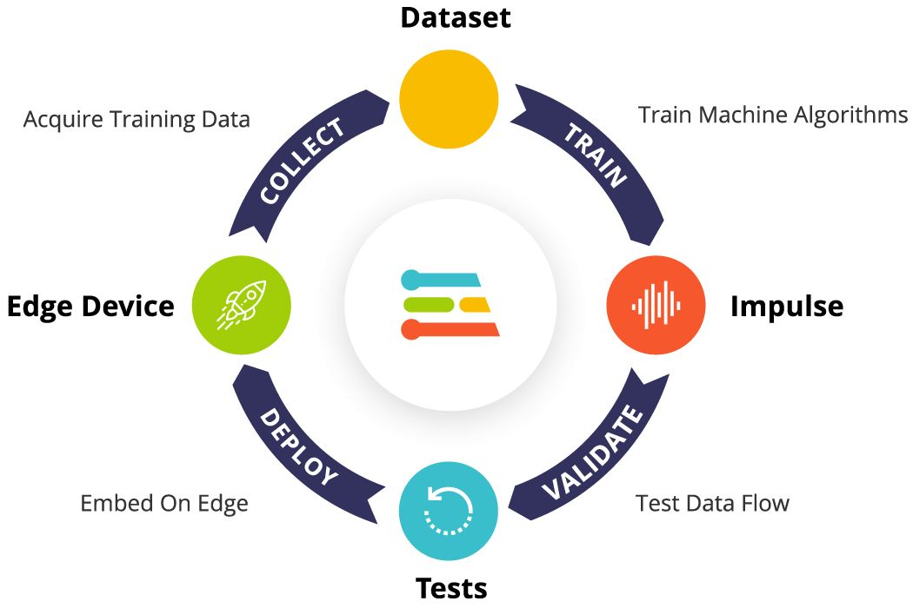

---

# Edge Impulse Account

- Start met het maken van een account voor Edge Impulse @ [https://www.edgeimpulse.com/](https://www.edgeimpulse.com/)
- Eens ingelogd kan je direct een nieuw project maken
  - Geef het nieuw project bv. de naam `flex-squat-detector`

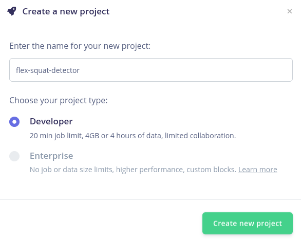

---

# Flex en Squat Detector

- Vervolgens dien je het type data aan te geven dat je zal verwerken.
- In ons geval is dit gewoon `Accelerometer Data`

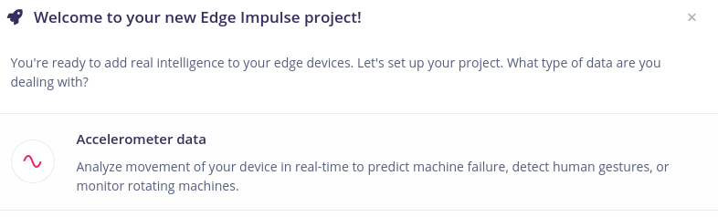

---

# Data vergaren

- Dit kunnen we aan de hand van Edge Impulse zelf en hun data forwarder tools.
- Ze ondersteunen een hele boel aan edge devices out of the box
- Voor elk bordje voorzien we dan ook tutorials.
- De nodige tools voor de Nano 33 BLE Sense zijn reeds voor jullie voorzien. Klik dus gerust onderaan rechts op `Let's get started!`.

---

# Flashen van de data forwarder

- Open een linux terminal
- Connecteer de Nano 33 BLE Sense via USB
- Druk 2x kort op de reset knop om het device in bootloader mode te plaatsen
  - Oranje LED gaat traag aan/uit
- Voer onderstaande commands uit

```bash
cd edge-impulse-data-forwarder
./flash_linux.sh
```

---

# Data forwarder flashed

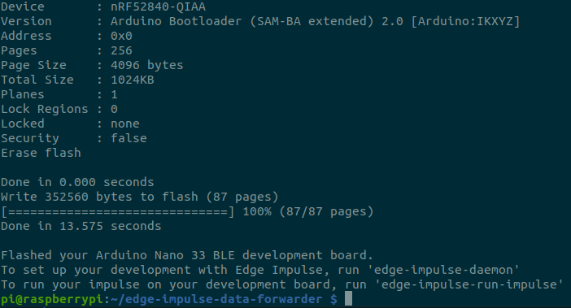

---

# Aanmelden via de CLI

- Nu dienen we aan te melden op Edge Impulse maar wel via de CLI
- Voer hiervoor onderstaande commando uit en volg de instructies

```bash
edge-impulse-daemon
```

---

# Klaar om data te capteren

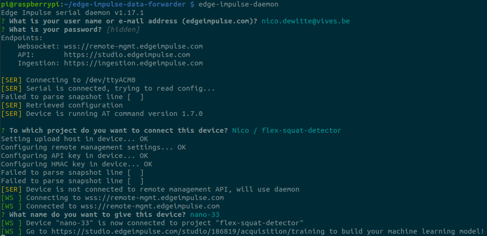

---

# Data Capteren

- Ga nu naar de website en klik links op  `Data acquisition`
- We gaan nu 3 keer data opnemen
  - 1x een 10-tal punches
  - 1x een 10-tal flexes
  - 1x een stil liggende sensor

---

# Data Capteren - Punches

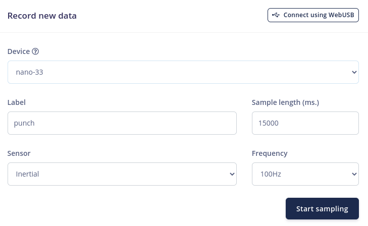

---

# Data Capteren - Punches

- Probeer een korte punch te geven en terug te keren naar een rust toestand.
- Je zou dan een 10 a 12 punches moeten kunnen geven
- Indien je data niet gelijkaardig is met onderstaande resultaat kan je gerust opnieuw samplen (verwijder de slechte data sets)

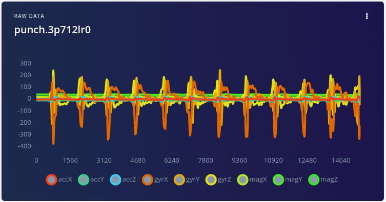

---

# Data Capteren - Flex

- Doe nu hetzelfde voor flexes

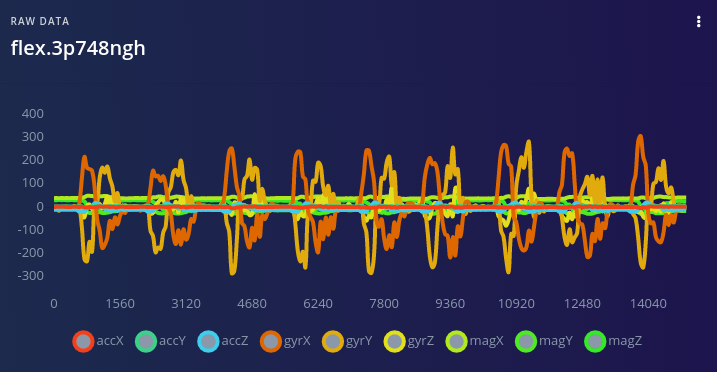

---

# Data Capteren - Stil

- Laat de sensor nu gewoon liggen

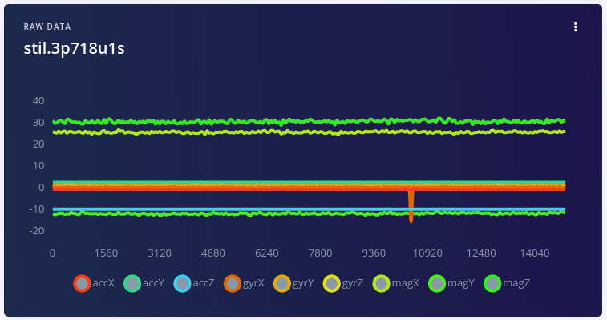

---

# Opsplitsen Data Samples Punches

- Nu hebben we telkens een 10-tal bewegingen gemaakt in 1 grote datastroom.
- Die dienen we op te splitsen in aparte samples
- Klik voor de reeks `punch` op de drie bolletjes en kies voor `Split sample`
  - Afhankelijk van de snelheid waarmee je hebt gepunched kan het zijn dat je nog een beetje moet spelen met de `Segment length`
  - Klik op `Split` als het ok is

---

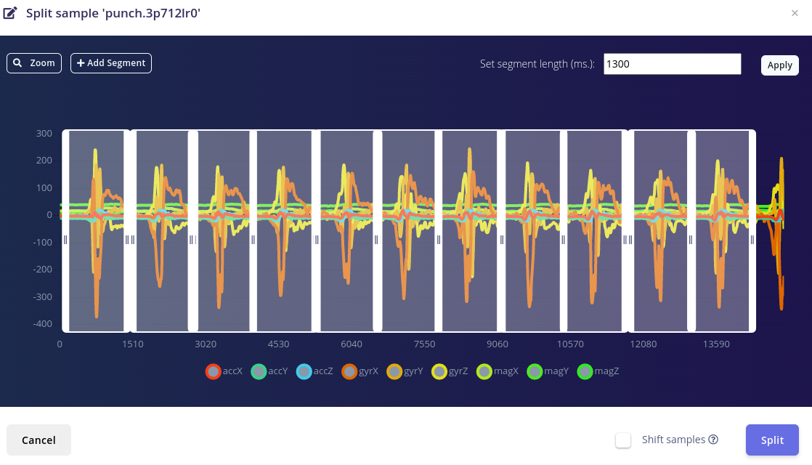

---

# Opsplitsen Data Samples Flex

- Doe hetzelfde voor de flexes
- Indien je merkt dat de flexes niet binnen hetzelfde window passen, hertrain deze dan misschien best.
- Indien nodig kan je de segmenten ook verschuiven of manueel bijplaatsen.
- Zorg wel dat je dezelfde lengte in tijd hebben als van je punches.

---

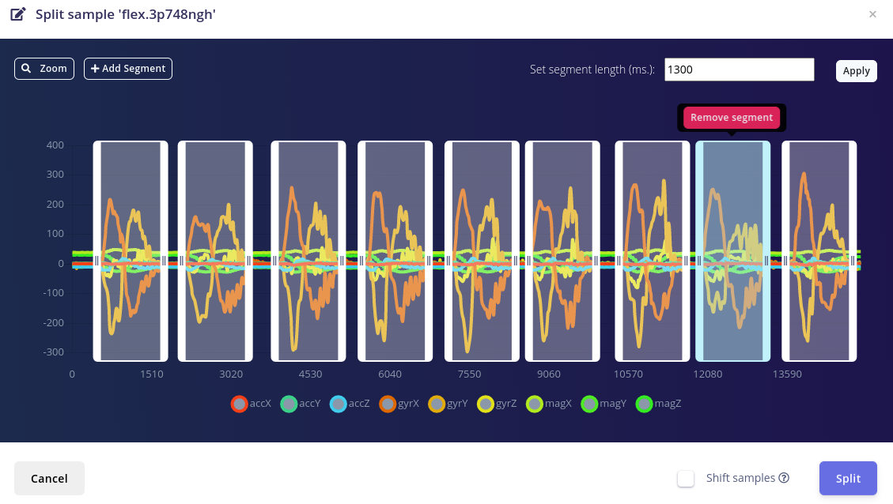

---

# Opsplitsen Data Samples Stil

- Nu nog eens hetzelfde voor geen beweging.
- Hier dien je zelf wat segmenten toe te voegen

---

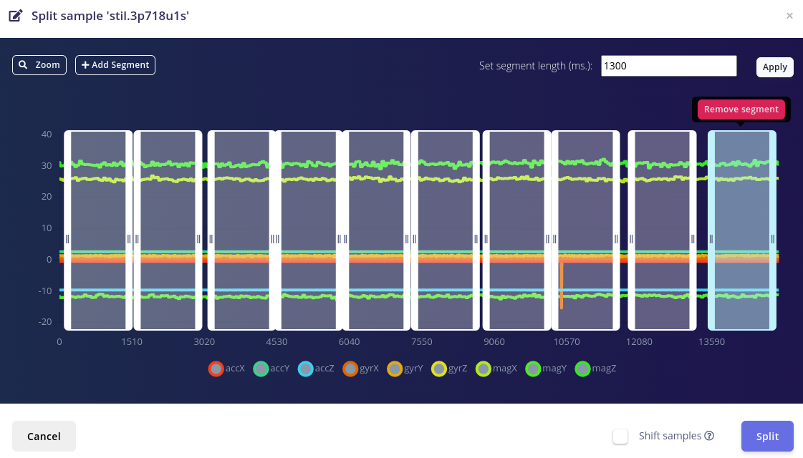

---

# Training en Test sets

- Merk op dat er warning staat bij `TRAIN / TEST SPLIT`
- Om de training van het toekomstige neurale netwerk te valideren, moet de dataset worden opgesplitst in een deel om te trainen en een deel om het resulterende netwerk te testen.
- In plaats van dit handmatig te doen, kunnen we Edge Impulse dit voor ons laten doen.
- Ga hiervoor naar `Dashboard` scroll naar beneden en klik op `Perform train/test split`
  - Dit kan niet ongedaan gemaakt worden.

---

# Heavy Lifting - Een model maken

- Kies in het menu voor `Impulse design`
- Kies de window size voor de input hetzelfde als de lengte van je samples

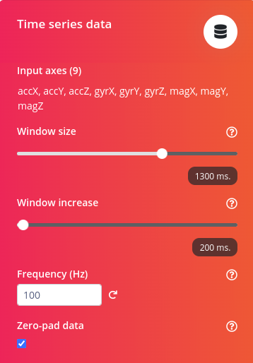

---

# Processing Block

- Vervolgens gaan we een processing block toevoegen
  - `Spectral Analysis`
    - Deze block gaat een frequentie-analyse uitvoeren op de tijds-data
  - We zouden de data ook ruw kunnen verwerken maar betere resultaten worden hier bekomen door eerst deze processing te doen

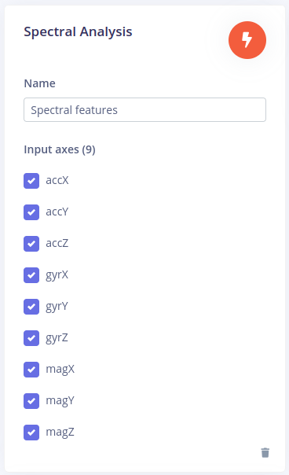

---

# Learning Block

- Het echte werk wordt dan gedaan door een `Learning block` toe te voegen die ons neuraal netwerk zal modeleren.
  - In ons geval gaan we voor `Classification`
    - Leert patronen uit data en kan deze toepassen op nieuwe data.
    - Geweldig voor het categoriseren van beweging of het herkennen van audio.
- Eens je klaar bent kies je voor `Save Impulse`

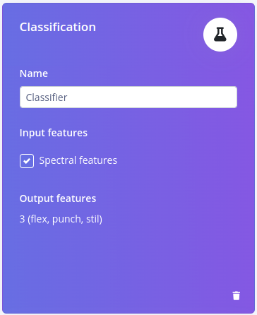

---

# Processen van de input data

- Kies links in het menu `Spectral Features` en klik op `Save Parameters`
  - Selecteer `Calculate feature importance`
  - Nu kan je `Generate Features` selecteren, wat de processing van de data in gang zal zetten.
  - Dit kan even duren
  - Het resultaat zou "geclusterde" data moeten opleveren

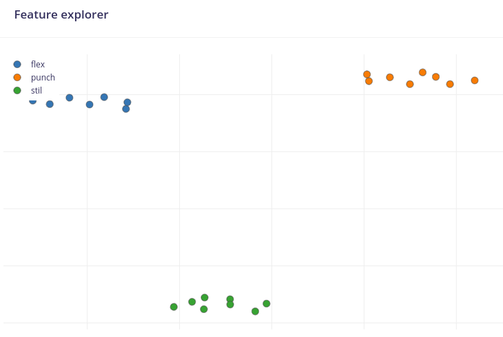

---

# Aanpassen/Trainen van het model

- Kies links in het menu voor `Classifier`
- In principe kan je dit model behouden zoals het is en kan je het gewoon trainen
  - Klik op `Start Training`

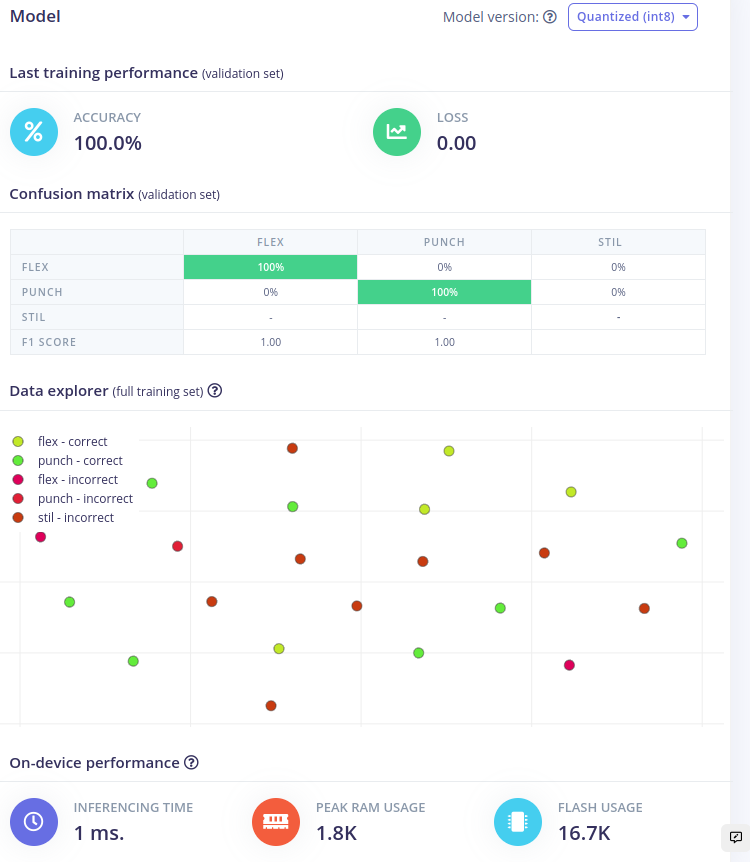

---

# Test Data Set

- Je kan je model nu ook nog eens testen met ongeziene data
- Dit kan je via het item `Model testing` links in het menu.

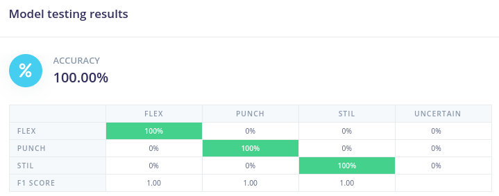

---

# Deployen op het Edge Device

- Als laatste kunnen we ons model nu exporteren zodat we het kunnen integreren in onze code
- Kies links in het menu voor `Deployment`
  - Kies vervolgens voor de `Arduino Library`
  - En klik helemaal onderaan op `Build`
- Je zou nu een zip-file moeten krijgen.
  - Download deze in de map `workshop-ai-essentials-nano/flex-squat`

---

## Edge Impulse

Setup integration with board:

https://docs.edgeimpulse.com/docs/development-platforms/officially-supported-mcu-targets/arduino-nano-33-ble-sense
https://arduino.github.io/arduino-cli/0.30/installation/


To restart fresh
```
edge-impulse-daemon --clean
```

Once the model is created we can create an arduino library which we can use. Then we just select the `nano_ble33_sense_fusion` example project.