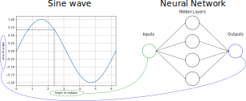

# <!-- fit --> The Hello World of Tensorflow Lite

- *Bron: TinyML (Machine Learning with TensorFlow Lite on Arduino and Ultra-Low-Power Microcontrollers) by Pete Warden & Daniel Situnayake*
- *Gebaseerd op de AI@EDGE Workshop: https://ai-edge-workshop.netlify.app/*

---

# Doel

- Een LED laten branden op basis van een sinus golf
- We gaan de sinus echter niet berekenen
- We gebruiken een AI model om de output te bepalen op basis van een input `x`

## Waarom ?

- Omdat het kan
- Stappen leren kennen voor het trainen van een AI model

---

---

# Jupyter Notebooks

- Wiskundige documenten die code (typisch Python) en documentatie samen bevatten
- Open de desktop shortcut `Jupyter Notebook`
- `CTRL` + klik op de URL

---

# Hello World Notebook

- Chromium zou nu moeten geopend zijn
- Open het bestand `/home/pi/workshop-ai-essentials-nano/hello-world/notebook.ipynb`
- Het laden kan even duren. Gelieve geduld te hebben en klik op `Wait` indien je een browser melding krijgt.
<!-- - Klik vervolgens op `Kernel => Restart & Clear Output` -->
- Klik vervolgens op `Thrust Notebook`
- **Geef elke stap rustig zijn tijd om uit te werken !**
- **Als rechts bovenaan de kernel als busy aangegeven staat, wacht dan even !**

---

# Stappen

In volgende slide vind je een overzicht van de stappen noodzakelijk om een dataset te maken, een model te trainen en te exporteren naar een microcontroller applicatie.

Meer uitleg is terug te vinden bij elke stap in het Jupyter notitieboek.

Voer de verschillende stappen een voor een uit om een idee te krijgen van de werking.

---

# Overzicht

1. Maken van een simpele dataset
   - Genereren van de data
   - Voeg wat ruis toe om het realistischer te maken
   - Split the data (training, validatie en test data)

2. Trainen van een klein model
   - Maken van een neuraal netwerk
   - Trainen van het neuraal netwerk
   - Plotten en analyse van de statistieken

3. Trainen van een groter model

---

# Overzicht

4. Genereren van een Tensorflow Lite model
   - Zonder kwantisering
   - Met kwantisering
   - Vergelijken van beide modellen

5. Genereer een Tensorflow Lite model voor de microcontroller
6. Flashen van de microcontroller

---

# Het model voor TensorFlow Lite

- Resulterend model is terug te vinden in de directory `/home/pi/workshop-ai-essentials-nano/hello-world/models`.
- `model.cc` bevat het gekwantiseerd model dat we net getrained hebben.
- De code in deze file gaan we samenvoegen met de applicatie om dit te compileren en te flashen.

---

# Eindresultaat

---

# En nu het serieuze werk

- [Flex en Squat](./flex_squat.html)
