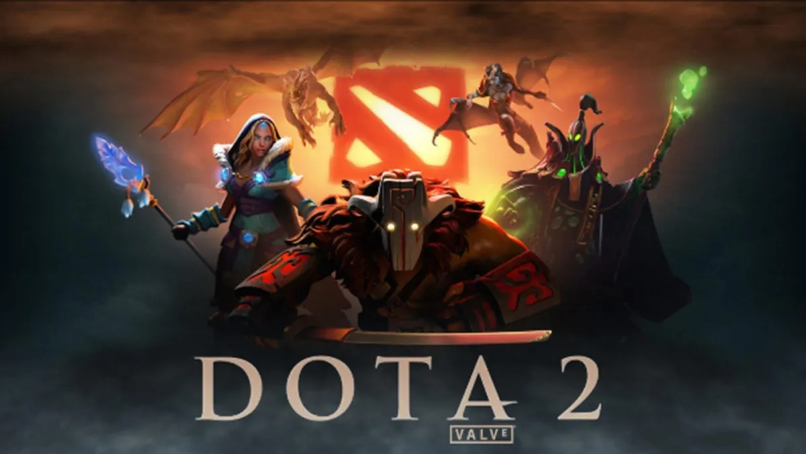
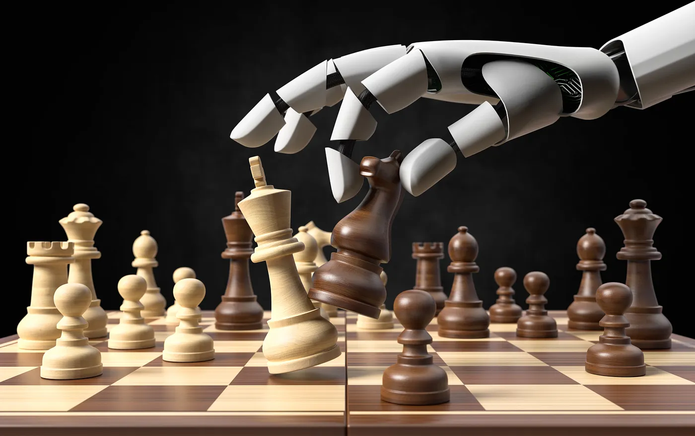
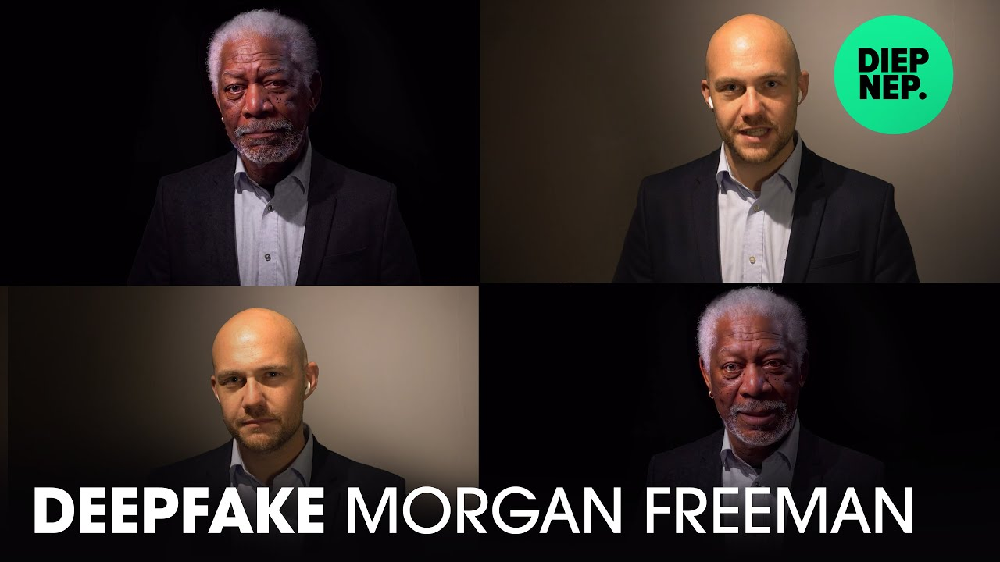

# <!-- fit --> Workshop AI Essentials

Welcome to this introductory workshop into Artificial Intelligence.

---

---

---

---

---

# OpenAI Five versus DOTA 2

- DOTA 2 is een multiplayer online battle arena (MOBA) game
  - Gemaakt door Valve
  - Tegenhanger van League of Legends
- OpenAI Five
  - Geleerd door meer dan 10.000 jaar aan games tegen zichzelf te spelen
  - **OpenAI** is een AI onderzoeks- en ontwikkelingsbedrijf met als missie om AI mainstream te maken

<!-- OpenAI heeft in 2019 de wereldkampioenen in DOTA2 verslagen door enkel tegen zichzelf te trainen. De AI kwam af met nieuwe strategieën die nog nooit eerder werden gebruikt. De AI kon ongeveer 250 jaar aan “training” simuleren per dag, ofwel ongeveer 45.000 jaar aan training gesimuleerd over 10 Real-Time maanden (OpenAI Five Defeats Dota 2 World Champions) -->

---

# AlphaZero versus Schaakmaster

- AlphaZero is een computerprogramma dat is ontwikkeld door **DeepMind**
  - AlphaZero is een meer algemeen programma van dat zich specialiseert in go, schaken en shogi (Japans schaken)
  - DeepMind is een onderzoeksbureau voor kunstmatige intelligentie
  - In 2014 is DeepMind opgekocht door **Google**

---

# AlphaStar versus StarCraft 2

- AlphaStar is een computerprogramma van **DeepMind** dat het videospel StarCraft II speelt.
- Het werd in januari 2019 met naam aan het publiek onthuld.
- Als een belangrijke mijlpaal voor kunstmatige intelligentie bereikte AlphaStar in augustus 2019 de Grandmaster-status.

---

# DeepFake

- Gedeeld door het Nederlandse deepfake YouTube-kanaal Diep Nep
- Waarbij het concept werd toegeschreven aan Bob de Jong en de (zeer goede) voice-acting aan Boet Schouwink.

---

# Assistants

- [DALL·E 2](https://labs.openai.com/)
  - Een AI-systeem dat realistische afbeeldingen en kunst kan maken van een beschrijving in natuurlijke taal.
- [ChatGPT](https://chat.openai.com/)
  - Artificiële chatbot gelanceerd door OpenAI die zeer snelle en gedetailleerde antwoorden kan geven binnen verschillende domeinen.
  - Het is gebouwd bovenop OpenAI's GPT-3-familie van grote taalmodellen.
  - Kan op een gemoedelijke manier met je communiceren.
- [DeepL](https://www.deepl.com/translator)
  - Een dienst voor neurale machinevertaling die in augustus 2017 is gelanceerd en eigendom is van het in Keulen gevestigde DeepL SE.

---

# Assistants

- [GitHub Copilot](https://github.com/features/copilot)
  - Een AI co-programmeur van GitHub
  - Hello World Demo met C++
- [Grammerly](https://app.grammarly.com/)
  - Grammarly is een Amerikaanse schrijf-assistent.

<!-- Nvidia DLSS 3: AI creëert nieuwe beelden in een video game op basis van voorgaande beelden -->

---

# What's Next

Let's learn a thing or two about AI.

- [Introduction in AI](./introduction.html)
- [Hello World](./hello_world.html)
- [Flex en Squat](./flex_squat.html)
