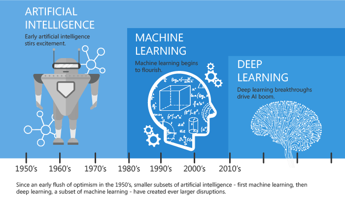
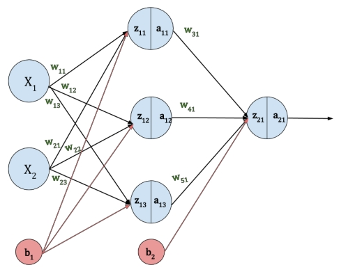
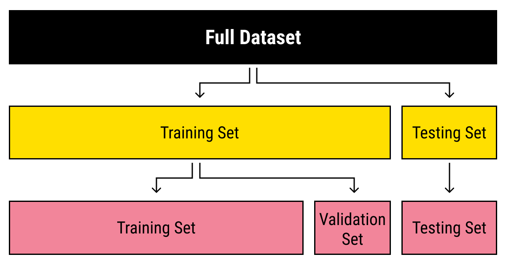
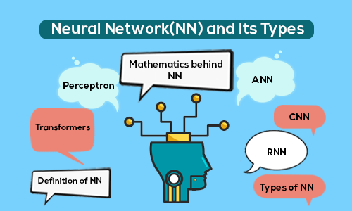
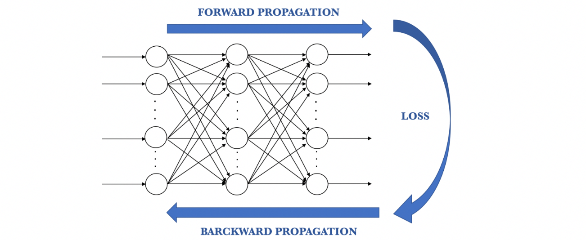
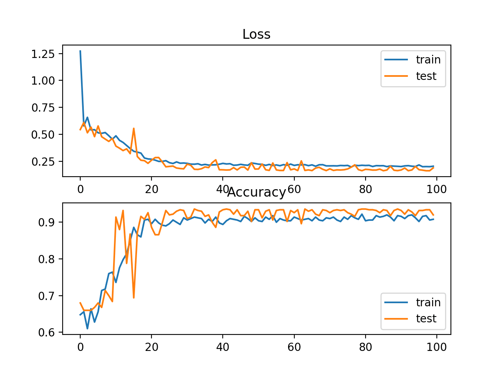
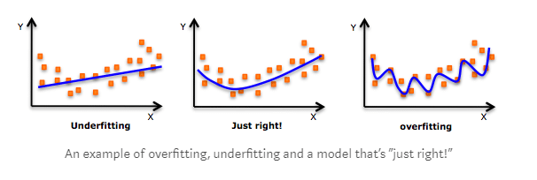
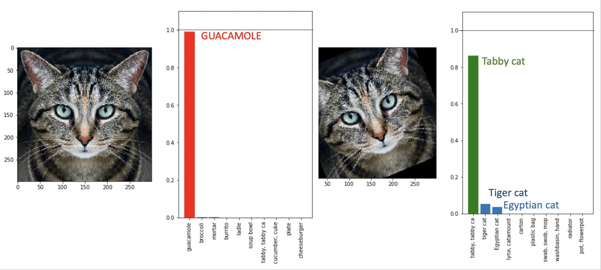

# <!-- fit --> Introductie in AI

"Want tegenwoordig is *AMAI* (Alles Met AI)"
_Franky Loret_

---

# Domeinen

---

# Kunstmatige/Artificiële Intelligentie

- Kunstmatige intelligentie (AI) is een breed gebied van informatica dat zich bezighoudt met de ontwikkeling van **intelligente machines** die taken kunnen uitvoeren waarvoor doorgaans menselijke intelligentie nodig is.
- Het doel van AI is om intelligente machines te creëren die kunnen **redeneren, leren, waarnemen en handelen** op een manier die **vergelijkbaar is met menselijke intelligentie**.

---

# Machine Learning

- Machine learning is het deelgebied van AI dat "computers het vermogen geeft om te leren zonder expliciet geprogrammeerd te zijn".
- Machine learning is de studie en constructie van algoritmen die kunnen leren van en voorspellingen kunnen doen over data

---

# Deep Learning

- Deep Learning is een subset van machine learning waarin meerlagige **neurale netwerken** leren van enorme hoeveelheden data.
- De ontwikkeling van neurale netwerken is de sleutel om machines de wereld te laten begrijpen zoals wij dat doen.
- Een neuraal netwerk is een type machine learning-model dat is ontworpen om de functie van het menselijk brein bij het verwerken en analyseren van informatie te simuleren.

---

# Neurale Netwerken

- Een neuraal netwerk is een machine learning-model **geïnspireerd op het menselijk brein**, bestaande uit verbonden knooppunten of neuronen die informatie verwerken en verzenden met behulp van gewogen verbindingen.
- Het is in staat **complexe patronen en relaties in gegevens te leren** en kan voor verschillende taken worden gebruikt.
- Een neuraal netwerk is in staat beslissingen te nemen, uitspraken te doen of voorspellingen te doen op basis van de gegevens die het heeft verstrekt.
- Door hier een **feedbacklus** aan toe te voegen, wordt **"leren"** mogelijk gemaakt en verandert zo de aanpak om een ​​probleem in de toekomst op te lossen.

---

# Een neuraal netwerk = basis wiskunde

- Input lagen
- Verborgen lagen
- Output lagen
- Nodes per laag
  - Gewicht
  - Bias / Offset
  - Activatiefunctie

---

# Deep Learning - Stap per Stap

1. **Data voorbereiding:** Dit omvat het verzamelen, opkuisen en voorbereiden van de data voor gebruik in het model.
   - Dit kan taken omvatten zoals data cleaning, data augmentatie (vergroting), feature extractie en normalisatie.

*Onthoud: shit in = shit out*

---

# Deep Learning - Stap per Stap

- Typisch gaan we onze data ook opdelen in 3 sets:

  1. **Training:** het grootste aantal gebruiken we om het model te trainen
  2. **Validatie:** wordt gebruikt tijdens het trainen om model bij te sturen
  3. **Testen:** wordt gebruikt na het trainen om te kijken hoe goed het model werkt

---

# Deep Learning - Stap per Stap

2. **Model ontwerp:** Dit omvat het kiezen van een geschikte neurale netwerk architectuur op basis van het probleemdomein en de beschikbare data.
   - Er zijn verschillende soorten neurale netwerken, waaronder feedforward, convolutional, recurrent en generatieve modellen.

---

# Deep Learning - Stap per Stap

3. **Het model trainen:** Dit gebeurt op de voorbereide data
   - Het doel is om het verschil tussen de voorspelde output en de werkelijke output te minimaliseren.
   - Het proces van training omvat voorwaartse en achterwaartse propagatie van informatie door het netwerk, waarbij de gewichten van de verbindingen worden bijgewerkt om de nauwkeurigheid van de voorspellingen te verbeteren.

---

# Deep Learning - Stap per Stap

<!-- The backpropagation algorithm involves several steps:

- Forward propagation: The input data is fed into the neural network and the output is calculated.
- Calculation of error: The difference between the predicted output and the actual output is calculated.
- Backward propagation: The error is propagated backward through the layers of the neural network, and the contribution of each neuron to the error is calculated.
- Weight updates: The weights of the connections between the neurons are adjusted based on the contribution of each neuron to the error. -->

<!-- **Supervised learning** involves training a neural network using labeled data, where the correct output is provided for each input. The goal of supervised learning is to learn a mapping between inputs and outputs, so that the network can accurately predict the output for new, unseen inputs. In supervised learning, the network is trained on a specific task, such as image classification, speech recognition, or sentiment analysis.

In contrast, **unsupervised learning** involves training a neural network using unlabeled data, where no information about the correct output is provided. The goal of unsupervised learning is to discover patterns in the data, such as clusters or groups of similar data points. Unsupervised learning is often used for tasks such as data clustering, anomaly detection, and dimensionality reduction. -->

---

# Deep Learning - Stap per Stap

4. **Evaluatie:** Dit omvat het evalueren van de prestaties van het getrainde model op een aparte validatie dataset of met behulp van cross-validation technieken.
     - De prestaties van het model worden gemeten met verschillende evaluatie metrics

---

# Deep Learning - Stap per Stap

5. **Fine-tuning:** Dit omvat het aanpassen van het model en de parameters om de prestaties ervan op de validatie dataset te verbeteren.
      - Dit kan het aanpassen van de leersnelheid, het toevoegen van regularisatietechnieken, het veranderen van de architectuur van het model en het afstemmen van de hyperparameters omvatten.

---

# Deep Learning - Stap per Stap

6. **Testen:** Dit omvat het testen van het uiteindelijke model op een aparte test dataset om de prestaties ervan op ongeziene data te evalueren.

---

# Opgelet ! Overfitting

- Het doel van deep learning modellen is om met behulp van trainingsdata goed te generaliseren naar eventuele data uit het probleemdomein.
- Dit is erg cruciaal omdat we willen dat ons model voorspellingen doet over de ongeziene dataset, dat wil zeggen dat het nog nooit eerder is gezien.
- Bij overfitting probeert het model te veel details in de trainingsgegevens te leren, samen met de ruis van de trainingsgegevens.
- Als gevolg hiervan zijn de modelprestaties erg slecht op ongeziene data.

---

# Volgende stappen?

7. **Kwantisatie:** Indien het model op een microcontroller moet runnen, kunnen we dit het best kwantiseren
   - Dit vermindert de precisie van de gewichten van het model, en mogelijk ook de activeringen (uitvoer van elke laag), wat geheugen bespaart, vaak zonder veel invloed op de nauwkeurigheid te hebben.
   - Gekwantiseerde modellen werken ook sneller, omdat de vereiste berekeningen eenvoudiger zijn (gehele getallen versus komma getallen).

---

# Volgende stappen?

8. **Inference:** dit is de fase waarin het netwerk aan het werk wordt gezet en voorspellingen dient uit te voeren.
   - De getrainde deep neural netwerken (DNN) doen **voorspellingen op nieuwe data** die het model nog nooit eerder heeft gezien.

# De handen vuil maken

Let's learn a thing or two about AI.

- [Hello World](./hello_world.html)
- [Flex en Squat](./flex_squat.html)
